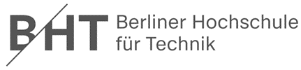

  
   <table width="100%" cellspacing="0" cellpadding="0" style="border:none;">
      <tbody>
        <tr>
          <td>Gruppe 1</td>
          <th>Sicherheitsmanagement Vertiefung 10</th>
          <td>01.07.2023</td>
        </tr>
        <tr class="blank_row">
              <td colspan="3"></td>
        </tr>
        <tr>
          <td>   </td>
          <td align="center">
            
          </td>
          <td></td>
        </tr>       
        <tr>
          <td></td>
          <td align="center">
            Fachbereich VI - Informatik und Medien Studiengang
            IT-Sicherheit Online / Medieninformatik
          </td>
          <td></td>
        </tr>
        <tr align="center">
          <td></td>
          <td style="font-weight:bold; padding:8px">Vertiefung 10 - Bedrohungsmodellierung, Programmierung</td>
          <td></td>
        </tr>
        <tr>
          <td></td>
          <td align="center">
            
          </td>
          <td></td>
        </tr>
        <tr>
          <td>Modul:</td>
          <td>Sicherheitsmanagement</td>
          <td></td>
        </tr>
        <tr>
          <td>Dozent:</td>
          <td>Sven Zehl</td>
          <td></td>
        </tr>
        <tr>
          <td>vorgelegt von:</td>
          <td>
            Gruppe 1 Christine Kuczera Dirk Drutschmann Hicham
            Naoufal Michael Schröter Jan Zimmermann Ivo Valls
          </td>
          <td></td>
        </tr>
      </tbody>
    </table>

## Aufgabe 1a) Aus Ihrem Use Case ging ein bestimmter Angreifer hervor, der es auf ein bestimmtes Asset abgesehen hat. Sein Angriffsvektor steht zufällig auf der Liste der OWASP Top 10. Behandeln Sie ihn mit Hilfe von Secure Design Pattern

**Antwort**

Um den für unseren Use Case Webauktionshause vorstellbaren niederschwelligen Angriffsvektor eines SQL-Injection-Angriffes durch, beispielhalber einem konkurrierenden Kunstvertreibenden, welcher aus unserer Datenbank die Kontaktdaten hochkarätiger Kunden auslesen möchte, möglichst vorzubeugen, könnten folgende Secure Design Patterns Anwendung finden.

Prepared Statements (Parameterized Queries): 
- Verwendung von Platzhaltern und parametrisierten Abfragen sichern, dass Benutzereingaben automatisch als Daten behandelt und nicht als Teil des SQL-Codes interpretiert werden.

Stored Procedures:
- Verwendung von vordefinierten und sicheren Stored Procedures reduzieren Angriffsflächen und machen die Ausführung von Abfragen sicherer.

Input Validation: 
- Validierung und Filterung alle Benutzereingaben vor der Verwendung in SQL-Abfragen:
 -Überprüfung der Eingaben auf erwartete Formate, erlaubte Zeichen und Längenbeschränkungen.
 -Entfernung oder Bereinigung potenziell schädlicher Zeichen oder Escape-Sequenzen, um Angriffe zu verhindern.

Whitelisting: 
- Verwendung von Whitelisting-Ansätze, um nur erlaubte Zeichen oder Werte zuzulassen und alle anderen abzulehnen.
- Überprüfung und Akzeptanz von nur bekannte und gültige Eingaben und Ablehnung potenziell schädliche Zeichen oder Syntax.

Least Privilege: 
- Reduzierung von Rechte und Berechtigungen von Datenbanknutzern zur Vorbeugung von Angriffen über kompromittierten Benutzerkontext.

Error Handling: 
- Implementierung einer sicheren Fehlerbehandlung und Unterdrückung detaillierte Fehlermeldungen, die potenziell sensible Informationen beinhalten könnten. 