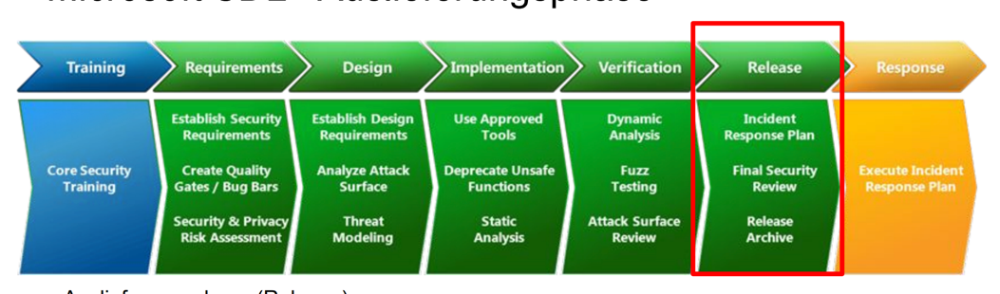

  
   <table width="100%" cellspacing="0" cellpadding="0" style="border:none;">
      <tbody>
        <tr>
          <td>Gruppe 1</td>
          <th>Sicherheitsmanagement Vorbereitung 1b</th>
          <td>24.04.2023</td>
        </tr>
        <tr class="blank_row">
              <td colspan="3"></td>
        </tr>
        <tr>
          <td>   </td>
          <td align="center">
            
          </td>
          <td></td>
        </tr>       
        <tr>
          <td></td>
          <td align="center">
            Fachbereich VI - Informatik und Medien Studiengang
            IT-Sicherheit Online / Medieninformatik
          </td>
          <td></td>
        </tr>
        <tr align="center">
          <td></td>
          <td style="font-weight:bold; padding:8px">Vorbereitung 1b</td>
          <td></td>
        </tr>
        <tr>
          <td></td>
          <td align="center">
            
          </td>
          <td></td>
        </tr>
        <tr>
          <td>Modul:</td>
          <td>Sicherheitsmanagement</td>
          <td></td>
        </tr>
        <tr>
          <td>Dozent:</td>
          <td>Sven Zehl</td>
          <td></td>
        </tr>
        <tr>
          <td>vorgelegt von:</td>
          <td>
            Gruppe 1 Christine Kuczera Dirk Drutschmann Hicham
            Naoufal Michael Schröter Jan Zimmermann Ivo Valls
          </td>
          <td></td>
        </tr>
      </tbody>
    </table>

<h1>Bedrohungsmodellierung und Entwicklung - Vertiefung</h1>

### a) Im Rollenspiel "Kosten der Sicherheit" müssen Sie dringend ein Sicherheitsupdate einspielen, da der Verdacht besteht, dass Hacker Malware vorbereiten. Es läuft aber gerade ein sehr großer Druckauftrag, den Sie nur für 5 min unterbrechen dürfen, ansonsten verstopfen die Düsen. Was müssen Sie beachten?

Das Einspielen eines Sicherheitsupdates ist ein kritischer Schritt, um die Integrität des Systems und die Vertraulichkeit der Daten zu schützen. Hier sind einige Aspekte, die beachten werden sollten:
<ul>
    <li><b>Priorisierung:</b> Beurteilung der Dringlichkeit des Updates und das Risiko, wenn es verzögert wird. Ist der Verdacht auf eine bevorstehende Malware-Attacke substantiell und gut begründet?</li>
    <li><b>Zeitfenster:</b> Finden eines geeigneten Zeitfensters für das Update, das den Betriebsablauf so wenig wie möglich stört. In diesem Fall stehen nur fünf Minuten zu Verfuegung, währenddessen der Druckauftrag pausiert werden kann. Es muss sichergestellt werden, dass das Update in dieser kurzen Zeit abgeschlossen werden kann. In der Realität könnte es schwierig sein, ein Update in so kurzer Zeit durchzuführen, daher müssen möglicherweise andere Alternativen in Betracht gezogen werden, wie z.B. das Temporäre Stoppen des Druckauftrags nach Abschluss, oder das Planen des Updates für einen späteren Zeitpunkt, wenn das Risiko einer Verstopfung der Düsen nicht besteht.</li>
    <li><b>Backup:</b> Vor der Installation des Sicherheitsupdates sollte ein Backup aller kritischen Daten und Systeme durchgeführt werden. So kann das System auf einen früheren Zustand zurückgesetzt werden, falls das Update Probleme verursacht.</li>
    <li><b>Testen:</b> Testen des Updates, wenn möglich, auf einer nicht-produktiven Systemumgebung, um sicherzustellen, dass es keine negativen Auswirkungen auf die Leistung oder Funktionalität hat.</li>
    <li><b>Kommunikation:</b> Informieren aller relevanten Parteien über die Notwendigkeit des Updates und die potenziellen Auswirkungen auf den Betrieb.</li>
</ul>

Das Rollenspiel wurde im Chat abhängig von den obigen Punkten erstellt. 

### b) Sie haben mit 4 Wochen Verzögerung ausgeliefert. Mittlerweile hatte der Kunde seine Software-Umgebung aktualisiert, und diese ist nicht vollständig abwärtskompatibel. In der Folge läuft ihre Software nicht sehr stabil. Wie sollte das CERT reagieren, wie gehen die Entwickler mit den täglichen Anrufen des Kunden um?

In einer solchen Situation ist eine schnelle und effiziente Kommunikation zwischen dem Kunden, dem 
CERT und den Entwicklern entscheidend. Hier sind einige Schritte, die unternommen werden könnten:

Abb1: Micrsoft SDL: besonders in den letzten beiden Phasen ist das CERT-Team essentiell

<ul>
    <li><b>Erfassung und Priorisierung der Probleme:</b> Das CERT sollte alle gemeldeten Probleme erfassen und priorisieren. Es sollte klar definiert werden, welche Probleme sofortige Aufmerksamkeit erfordern und welche warten können.</li>
    <li><b>Untersuchung und Lösungsentwicklung:</b> Die Entwickler sollten die Berichte untersuchen und feststellen, warum die Software in der neuen Umgebung des Kunden instabil ist. Sie sollten dann an Lösungen arbeiten, um diese Probleme zu beheben.</li>
    <li><b>Kommunikation mit dem Kunden:</b> Der Kunde sollte regelmäßig über den Fortschritt informiert werden. Diese Kommunikation sollte klar und ehrlich sein, um das Vertrauen des Kunden zu bewahren.</li>
    <li><b>Anpassung des Supports:</b> Aufgrund der erhöhten Anzahl von Kundenanrufen sollte das Support-Team so organisiert sein, dass es diese effektiv bewältigen kann. Dies könnte bedeuten, dass mehr Personal bereitgestellt wird oder dass Support-Techniker speziell geschult werden, um mit den spezifischen Problemen umzugehen, die durch die Inkompatibilität der Software-Umgebung verursacht werden.</li>
    <li><b>Erstellung und Bereitstellung von Patches:</b> Sobald die Entwickler Lösungen für die identifizierten Probleme gefunden haben, sollten sie diese in Form von Patches bereitstellen. Diese Patches sollten getestet werden, bevor sie dem Kunden zur Verfügung gestellt werden.</li>
    <li><b>Lessons Learned:</b> Schließlich sollte das gesamte Team die Situation analysieren und Lehren für die Zukunft ziehen. Dies könnte bedeuten, dass die Prozesse für die Softwareentwicklung und -lieferung überprüft und angepasst werden, um solche Probleme in Zukunft zu vermeiden.</li>
</ul>
