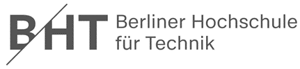

  
   <table width="100%" cellspacing="0" cellpadding="0" style="border:none;">
      <tbody>
        <tr>
          <td>Gruppe 1</td>
          <th>Sicherheitsmanagement Vertiefung 9</th>
          <td>15.06.2023</td>
        </tr>
        <tr class="blank_row">
              <td colspan="3"></td>
        </tr>
        <tr>
          <td>   </td>
          <td align="center">
            
          </td>
          <td></td>
        </tr>       
        <tr>
          <td></td>
          <td align="center">
            Fachbereich VI - Informatik und Medien Studiengang
            IT-Sicherheit Online / Medieninformatik
          </td>
          <td></td>
        </tr>
        <tr align="center">
          <td></td>
          <td style="font-weight:bold; padding:8px">Vertiefung 9</td>
          <td></td>
        </tr>
        <tr>
          <td></td>
          <td align="center">
            
          </td>
          <td></td>
        </tr>
        <tr>
          <td>Modul:</td>
          <td>Sicherheitsmanagement</td>
          <td></td>
        </tr>
        <tr>
          <td>Dozent:</td>
          <td>Sven Zehl</td>
          <td></td>
        </tr>
        <tr>
          <td>vorgelegt von:</td>
          <td>
            Gruppe 1 Christine Kuczera Dirk Drutschmann Hicham
            Naoufal Michael Schröter Jan Zimmermann Ivo Valls
          </td>
          <td></td>
        </tr>
      </tbody>
    </table>

## Aufgabe 1) Wie steht Single Point of Failure zu den o.g. Design Principles?

**Antwort**

***Least Privilege:***

 Das Prinzip des geringsten Privilegs trägt indirekt zur Reduzierung des Risikos eines Single Point of Failure bei. Indem Benutzer und Systeme nur die minimalen Rechte und Berechtigungen erhalten, die sie benötigen, wird das Risiko eines versehentlichen oder böswilligen Ausfalls einer kritischen Komponente verringert.

***Secure the Weakest Link:***

 Das Prinzip, die schwächsten Glieder zu sichern, trägt dazu bei, Single Points of Failure zu identifizieren und zu beheben. Durch die Stärkung der am anfälligsten Komponenten oder Schwachstellen eines Systems wird das Risiko eines einzigen Ausfallpunktes verringert, der das gesamte System beeinträchtigen könnte.

***Defense in Depth:***

 Dieses Prinzip beinhaltet die Implementierung mehrerer Verteidigungslinien, um das Risiko eines Single Point of Failure zu verringern. Indem verschiedene Schutzebenen und Schutzmaßnahmen implementiert werden, wird vermieden, dass der Ausfall einer einzelnen Komponente das gesamte System gefährdet.

***No Security by Obscurity:***

 Das Prinzip besagt, dass die Sicherheit eines Systems nicht von Geheimhaltung oder Verborgenheit der Sicherheitsmechanismen abhängen sollte. Dies ist wichtig, um mögliche Single Points of Failure offen zu identifizieren und angemessene Sicherheitsmaßnahmen zu ergreifen, anstatt sich auf geheime oder obskure Methoden zu verlassen, die möglicherweise nicht robust sind.

***Secure by Default:***

 Indem ein System standardmäßig sicher konfiguriert ist, wird das Risiko eines Single Point of Failure verringert. Ein sicheres Design von Anfang an gewährleistet, dass das System von Grund auf gegen bekannte Schwachstellen und Angriffe geschützt ist.

***Fail Safe:***

 Das Prinzip der Fail Safe-Designs zielt darauf ab, dass ein System im Falle eines Ausfalls in einen sicheren Zustand übergeht, um weiteren Schaden zu verhindern. Dies trägt dazu bei, die Auswirkungen eines Single Point of Failure zu minimieren und das System vor unerwünschten Folgen zu schützen.

***Validate Input, Encode Output:***

 Durch die Validierung von Eingaben und das sichere Kodieren von Ausgaben wird das Risiko von Single Points of Failure verringert, die durch schädliche Eingaben oder unsichere Ausgaben verursacht werden könnten. Dadurch wird verhindert, dass schädlicher Code in das System gelangt oder vertrauliche Informationen offengelegt werden, was zu Ausfällen führen könnte.

***Minimize Attack Surface:***

 Durch die Reduzierung der Angriffsfläche eines Systems wird das Risiko eines Single Point of Failure verringert. Indem unnötige Funktionen, Dienste oder Schnittstellen entfernt oder eingeschränkt werden, werden potenzielle Angriffspunkte minimiert und das System widerstandsfähiger gegenüber einzelnen Ausfällen.

***Don't Mix Code and Data:***

 Durch die Trennung von ausführbarem Code und Daten wird das Risiko eines Single Point of Failure verringert, der durch Code-Injektionen oder Datenbeschädigungen verursacht werden könnte. Durch die klare Trennung von Code und Daten wird die Integrität des Systems gewährleistet und das Risiko von Ausfällen minimiert.

Insgesamt tragen die oben genannten Designprinzipien dazu bei, die Wahrscheinlichkeit eines Single Point of Failure zu verringern, indem sie die Sicherheit und Robustheit des Systems auf verschiedenen Ebenen verbessern.

## Aufgabe 1a) Rollenspiel, Fehlerkultur: Wie kann der Entwicklungsleiter sicherstellen, dass die Entwickler gut dokumentieren? Warum vermeiden die Entwickler i.R. Kommentare im Code? 

Siehe: [https://hetzlefetz.github.io/uni-sicherheitsmanagement/chat/dist/index.html](https://hetzlefetz.github.io/uni-sicherheitsmanagement/chat/dist/index.html)