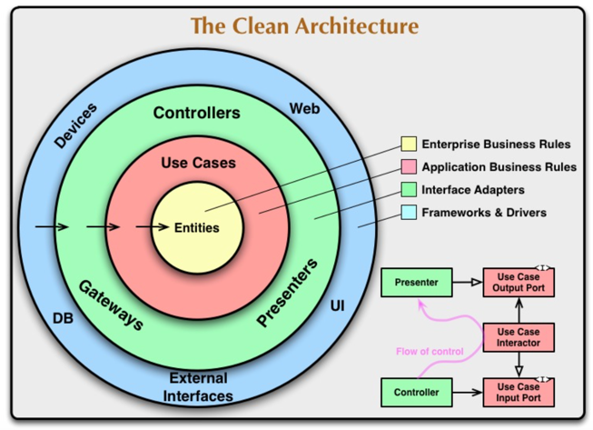
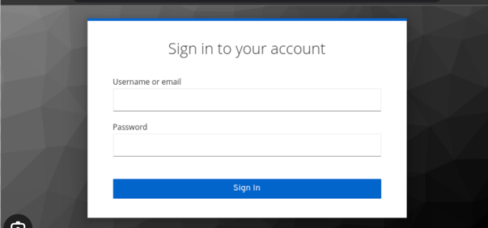

  <style>
    table, tr, td {
        border-collapse: collapse !important;
    border: none !important;
}
.centered{
    align:"center";
}
.blank_row
{
    height: 10px !important; /* overwrites any other rules */
    background-color: #FFFFFF;
}
    </style>
   <table width="100%" cellspacing="0" cellpadding="0" style="border:none;">
      <tbody>
        <tr>
          <td>Gruppe 1</td>
          <th>Sicherheitsmanagement<br />Vorbereitung 1b</th>
          <td>24.04.2023</td>
        </tr>
        <tr class="blank_row">
              <td colspan="3"></td>
        </tr>
        <tr>
          <td><br /><br /><br /></td>
          <td align="center">
            
          </td>
          <td></td>
        </tr>       
        <tr>
          <td></td>
          <td align="center">
            Fachbereich VI - Informatik und Medien<br />Studiengang
            IT-Sicherheit Online / Medieninformatik
          </td>
          <td></td>
        </tr>
        <tr align="center">
          <td></td>
          <td style="font-weight:bold; padding:8px">Vorbereitung 10</td>
          <td></td>
        </tr>
        <tr>
          <td></td>
          <td align="center">
            
          </td>
          <td></td>
        </tr>
        <tr>
          <td>Modul:</td>
          <td>Sicherheitsmanagement</td>
          <td></td>
        </tr>
        <tr>
          <td>Dozent:</td>
          <td>Sven Zehl</td>
          <td></td>
        </tr>
        <tr>
          <td>vorgelegt von:</td>
          <td>
            Gruppe 1<br />Christine Kuczera<br />Dirk Drutschmann<br />Hicham
            Naoufal<br />Michael Schröter<br />Jan Zimmermann<br />Ivo Valls
          </td>
          <td></td>
        </tr>
      </tbody>
    </table>
<div style="page-break-after: always">
<h1>Design Pattern zur Sicherheit für unseren Webshop Use-Case</h1>

Unser Webshop besteht aus einem Front-End, einem Back-End und einer Datenbank. Um mögliche Angriffsvektoren zu vermeiden,
habe ich folgende Design Patterns recherchiert, um die Sicherheit zu erh&ouml;hen:

<h2>Schichtenarchitektur (Layered Architecture)</h2>
<p>Wir setzen auf eine Schichtenarchitektur, die unsere Anwendung in separate Schichten unterteilt, wie z.B. die 
Präsentationsschicht, die Geschäftslogikschicht und die Datenzugriffsschicht. Dies ermöglicht es uns, die Sicherheit zu 
erhöhen, indem wir sicherstellen, dass jede Schicht nur auf die darunterliegenden Schichten zugreifen kann und Eingaben 
ordnungsgemäß validiert und verarbeitet werden.</p>

Eine sehr moderner und beliebter Ansatz ist Clean Architecture von Uncle Bob. 



<p>Clean Architecture ist ein Architekturmuster, das auf dem Konzept der Schichtenarchitektur aufbaut. Es legt jedoch 
zusätzlich Wert auf die Trennung von Geschäftslogik und technischen Details. In Clean Architecture werden klare 
Abhängigkeitsrichtungen zwischen den Schichten definiert, wobei die inneren Schichten unabhängig von den äußeren 
Schichten bleiben. Dadurch wird eine hohe Flexibilität, Testbarkeit und Wartbarkeit der Software erreicht. 
Die äußeren Schichten, wie das Framework oder die Datenbank, sind von den inneren Schichten isoliert, sodass Änderungen 
in den äußeren Schichten keinen Einfluss auf die inneren Schichten haben. Die Geschäftslogik befindet sich im Kern der 
Anwendung und wird von externen Einflüssen entkoppelt. Dadurch wird die Anwendung unabhängig von Frameworks, Datenbanken
oder anderen externen Ressourcen.</p>

<h2>Input-Validierung</h2>

Wir implementieren gründliche Validierungsmechanismen für alle Benutzereingaben sowohl auf der Client-Seite als auch auf
der Server-Seite. Dabei verwenden wir Whitelisting-Ansätze, um nur erlaubte Zeichenmuster zuzulassen, und filtern 
unerwünschte Zeichen und Angriffsmuster heraus. Besonders wichtig ist die Validierung auf der Server-Seite, da 
Client-seitige Validierungen umgangen werden können. Es ist wichtig, dass man im Backend auch Messaging Schichten (bsp. Kafka)
nicht von der Validierung ausnimmt.

Serverseitige Validierung in NestJS mit Class Validator:

```
class CreateUserDto {
    @IsEmail()
    email: string;

    @IsNotEmpty()
    password: string;
}
```

Einsatz im Controller mit Hilfe von Decorators:

```
@Post()
create(@Body() createUserDto: CreateUserDto) {
  return 'This action adds a new user';
}
```

<h2>Prepared Statements (Vorbereitete Anweisungen) und ORM</h2>

Um SQL-Injection-Angriffe zu verhindern, verwenden wir parametrisierte Abfragen oder gespeicherte Prozeduren in unserer 
Datenbank. Benutzereingaben werden nicht direkt in SQL-Abfragen eingefügt, sondern als Parameter übergeben. Alternativ 
kann man auch bekannte ORM nutzen wie in Java Hibernate oder in Javascript TypeORM. ORM haben ein Sanitizer build-in, der
den Code &uuml;berpr&uuml;ft.

Hier kann man eine Entity in TypeORM anlegen:
```
@Entity()
export class Photo {
  @PrimaryGeneratedColumn()
  id: number;

  @Column({ length: 500 })
  name: string;

  @Column('text')
  description: string;

  @Column()
  filename: string;

  @Column('int')
  views: number;

  @Column()
  isPublished: boolean;
}
```
So kann man dann sicher SQL-Abfragen machen:

```
  async findAll(): Promise<Photo[]> {
    return this.photoRepository.find();
  }
```

<h2>Authentifizierung und Autorisierung</h2>

Wir implementieren robuste Mechanismen zur Authentifizierung und Autorisierung, um sogenannte 
"Broken Authentication"-Angriffe zu verhindern. Dabei setzen wir bewährte Verfahren wie sichere Passwortspeicherung 
mit Hashing und Salting ein, verwenden Session-Management-Mechanismen und prüfen die Berechtigungen eines Benutzers, 
bevor wir ihm Zugriff auf bestimmte Funktionen oder Daten gewähren. 

Wenn man die Authentifizierung und Auth. auf low-level
Ebene implementieren will, bieten sich Hashing Algorithmen wie "BCrypt" mit Passport in Nodejs an.

Besser noch ist das Nutzen von Third-Party Tools, wie Auth0 (ich mache keine Werbung =D) oder das kostenlose Tool KeyCloak.




<h2>Schutz vor Cross-Site Scripting (XSS)</h2>

Wir validieren und filtern alle Benutzereingaben, die in unsere Webseiten 
eingefügt werden, um XSS-Angriffe zu verhindern. Zusätzlich verwenden wir Escaping-Mechanismen, um potenziell 
schädlichen Code unschädlich zu machen.

Helmet ist ein klassisches Tool, welches hier eingesetzt werden kann. Ohne Parameter, wird die Standard Config geladen:

```
app.use(helmet())

// ein anderes Beispiel
 app.use(
  helmet.contentSecurityPolicy({
    useDefaults: true,
    directives: {
      "script-src": ["'self'", "securecoding.com"],
      "style-src": null,
    },
  })
 );
```

<h2>Schutz vor Cross-Site Request Forgery (CSRF)</h2>
Um CSRF-Angriffe zu verhindern, implementieren wir CSRF-Token. Dadurch stellen wir sicher, dass nur autorisierte Benutzer
Aktionen auf unserer Webseite ausführen können. Bei jedem Formular- oder AJAX-Request übermitteln und überprüfen wir ein
CSRF-Token.

```
app.get('/form', csrfProtection, function (req, res) {
    // pass the csrfToken to the view
    res.render('login', { csrfToken: req.csrfToken() });
});
```

Diese Design Patterns helfen uns dabei, unseren Webshop sicherer zu gestalten und die genannten Angriffsvektoren zu 
minimieren. Wir berücksichtigen dabei die spezifischen Anforderungen und Gegebenheiten unseres Use Cases und ergreifen 
gegebenenfalls weitere Sicherheitsmaßnahmen.

</div>
