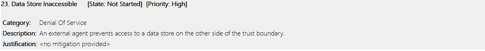

  
   <table width="100%" cellspacing="0" cellpadding="0" style="border:none;">
      <tbody>
        <tr>
          <td>Gruppe 1</td>
          <th>Sicherheitsmanagement Vorbereitung 7</th>
          <td>27.05.2023</td>
        </tr>
        <tr class="blank_row">
              <td colspan="3"></td>
        </tr>
        <tr>
          <td>   </td>
          <td align="center">
            
          </td>
          <td></td>
        </tr>       
        <tr>
          <td></td>
          <td align="center">
            Fachbereich VI - Informatik und Medien Studiengang
            IT-Sicherheit Online / Medieninformatik
          </td>
          <td></td>
        </tr>
        <tr align="center">
          <td></td>
          <td style="font-weight:bold; padding:8px">Vorbereitung 7 - Bedrohungsmodellierung, Unternehmensebene</td>
          <td></td>
        </tr>
        <tr>
          <td></td>
          <td align="center">
            
          </td>
          <td></td>
        </tr>
        <tr>
          <td>Modul:</td>
          <td>Sicherheitsmanagement</td>
          <td></td>
        </tr>
        <tr>
          <td>Dozent:</td>
          <td>Sven Zehl</td>
          <td></td>
        </tr>
        <tr>
          <td>vorgelegt von:</td>
          <td>
            Gruppe 1 Christine Kuczera Dirk Drutschmann Hicham
            Naoufal Michael Schröter Jan Zimmermann Ivo Valls
          </td>
          <td></td>
        </tr>
      </tbody>
    </table>

## Aufgabe 1a) Ermitteln Sie im Rollenspiel Kosten der Sicherheit im Interview mit ihrem Geschäftsführer folgende Eckpunkte:
1) Unternehmenswerte 2) Anwenderanforderung 3) Sicherheitsziele
4) Angreifer 

**Antwort**
Nach Rücksprache mit dem Kunden, wurde Folgendes identifiziert:

| Unternehmenswerte                                                                                                             | Anwenderanforderungen                                                  | Sicherheitsziele | Angreifer                               |
|-------------------------------------------------------------------------------------------------------------------------------|------------------------------------------------------------------------|------------------|-----------------------------------------|
| Auktionsdaten müssen  vertrauenswürdig und unveränderlich sein                                                            | Auktionsdaten dürfen nicht manipulierbar sein                          | Integrität       | Insider-Bedrohungen,  Hacker         |
| Zahlungsinformation                                                                                                           | Zahlungsinformationen  dürfen nicht an Unbefugte  gelangen      | Vertraulichkeit  | Finanzamt,  Hacker                   |
| Nur berechtigte User dürfen auf ihre Konten zugreifen  und persönlicher Informationen müssen vertraulich behandelt werden | Sichere Authentifizierung mittels  zweifelsfreier Identitätsprüfung | Authentizität    | Phishing-Angreifer,  Identitätsdiebe |

## Aufgabe 1b) Laden Sie das Microsoft Threat Modeling Tool herunter, installieren Sie es und vollziehen Sie AntrAnw-I nach. - Windows. 

**Antwort**

Das Microsoft Threat Modeling Tool bietet mit AntrAnw-I (Anwendung von Angriffszenarien auf Anwendungsschnittstellen) eine Methode zur Durchführung dieser Art von Analyse, indem es eine systematische und strukturierte Herangehensweise bietet, um potenzielle Bedrohungen zu identifizieren und zu bewerten. Es ermöglicht den Entwicklern, verschiedene Angriffszenarien auf die Anwendungsschnittstellen anzuwenden und daraus resultierende Risiken zu visualisieren, um geeignete Gegenmaßnahmen zu planen und umzusetzen.

Anhand einiger Beispiele aus dem angehangenen Report, würden sich folgende Maßnahmen ergeben.

### SQL Injection

#### Art des Angriffs
Mittels speziell präperierten Eingaben, können Angreifer Code in der Datenbank ausführen.
#### Angreifer
Typischerweise wird diese Art von Angriff von automatisierten Tools und Skript Kiddies ausgeführt, da sehr niederschwellig ausnutzbar.
#### Mögliche Abwehrstrategien
Verwendung von prepared Statements und befolgen allgemein guter Programmierpraktiken.

### Evaluation of Privilege Using Remote Code Execution

#### Art des Angriffs
Schwachstelle in der Anbindung zu einem externen Bezahlservice, bieten die Möglichkeit schadhaften Code einzuschleusen und auszuführen. Durch den Remote Code Execution-Angriff können Angreifer Ausführungsberechtigungen der Anwendung übernehmen und erweiterte Privilegien erlangen.
#### Angreifer
Hacker oder böswilliger Zulieferer. 
#### Mögliche Abwehrstrategien
Updates und Sicherheitspatches für die Anwendung implementieren, um bekannte Schwachstellen zu beheben und potenzielle Angriffsvektoren zu minimieren.
Ebenso wie sichere Eingabevalidierung und sicheres Datenbankmanagement.
Implementierung strenger Zugriffskontrollen und Berechtigungsmechanismen, stellen sicher, dass nur autorisierte Benutzer auf sensible Funktionen und Ressourcen zugreifen können. Dies kann dazu beitragen, dass selbst bei einem erfolgreichen Angriff die Privilegien des Angreifers begrenzt sind.

### Denial Of Service

#### Art des Angriffs
Die Angreifer schaffen es die Datenhaltung anzugreifen, so dass das die Anwendung nicht mehr auf gespeicherte Daten zugreifen kann, z.B. über Ransomware.
#### Angreifer
Hacker, Naturkatastrophen, Sabotage.
#### Mögliche Abwehrstrategien
Etablieren von Backups und Prozeduren, diese wieder einzuspielen. Diese sollten regelmäßig getestet und auch durchgeführt werden. Außerdem kann der Dienst über mehrere physikalische Lokationen verteilt werden, um sich z.B. vor Naturkatastrophen zu schützen. 